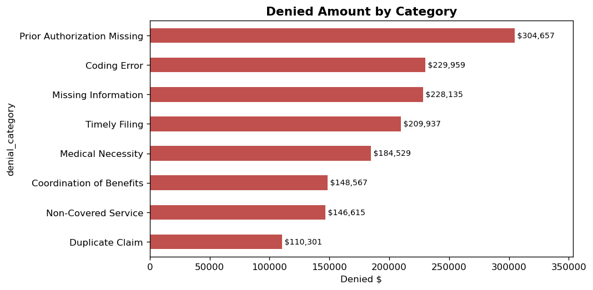
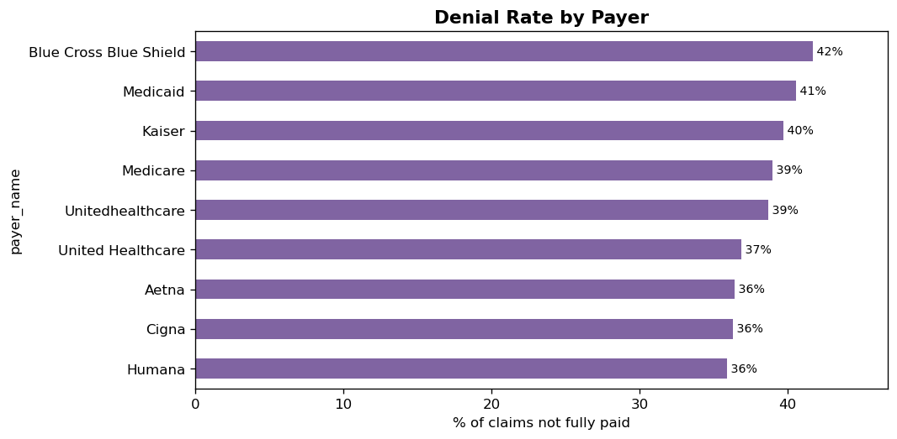

# Healthcare Claims & Denials Analysis — Python / pandas

An analysis of **5,000+ healthcare claims** in Python (pandas + matplotlib), answering
*how much revenue is lost to denials, why, and how much is recoverable* — the core
questions of healthcare revenue-cycle management (RCM).

> **Data:** synthetic claims dataset (`data/claims_data.csv`) — not real patient or payer data.

## Key visuals



**Headline findings:** 39% denial rate · **$911K** in soft (recoverable) denials · **$394,915** not yet appealed — the clearest untapped recovery opportunity, concentrated in *Prior Authorization Missing* denials and *Blue Cross Blue Shield*.

## What it covers
- Data cleaning — duplicates, missing values, payer-name normalisation
- RCM KPIs — Net Collection Rate, Denial Rate, Soft (Recoverable) Denial value
- Denial analysis — by category and by payer
- A/R aging analysis and billed-vs-paid trend
- Charts with matplotlib

## Key skills
`pandas` · data cleaning · groupby aggregations · time resampling · matplotlib · healthcare RCM domain

## Run it
```bash
python3 -m venv venv && source venv/bin/activate
pip install -r requirements.txt
jupyter notebook claims_denials_analysis.ipynb
```

## Author
**Hanspal Singh** — Data Analyst · Microsoft PL-300 Certified · 7 yrs healthcare RCM
[LinkedIn](https://www.linkedin.com/in/hanspal-s-7b76843a8/)
